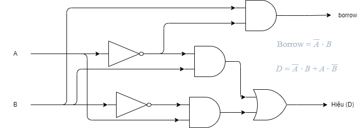

[Quay lại](README.md)
# Định nghĩa
Một mạng logic hay một mạng các cổng là một hệ thống có dạng:
- input: x1, x2, ... là các biến bool
- output: f(x1, x2, ..) là hàm bool

# Các cổng logic cơ bản:

- gồm 4 cổng chính: AND, OR, NOT, XOR

# Mạch trừ 1 bit

## 1. **Thiết lập bảng chân trị**

| A | B | D (A−B) | Borrow |
| - | - | ------- | ------ |
| 0 | 0 | 0       | 0      |
| 0 | 1 | 1       | 1      |
| 1 | 0 | 1       | 0      |
| 1 | 1 | 0       | 0      |

---

## 2. **Thiết lập biểu thức logic từ bảng chân trị**

### a. Hiệu (D):

Nhìn vào bảng, ta thấy D = 1 tại các hàng:

* A=0, B=1
* A=1, B=0

Ta viết minterms tương ứng:

$$
D = \overline{A} \cdot B + A \cdot \overline{B}
$$

---

### b. Borrow:

Chỉ có một trường hợp Borrow = 1:

* A=0, B=1

Biểu thức:

$$
\text{Borrow} = \overline{A} \cdot B
$$

---

## 3. **Rút gọn biểu thức**

### a. Hiệu (D):

Không thể rút gọn thêm — đây **chính là dạng tối giản** rồi.
Vì D là **XOR**, và biểu thức:

$$
D = \overline{A} \cdot B + A \cdot \overline{B}
$$

là biểu diễn XOR bằng các cổng cơ bản.

### b. Borrow:

Biểu thức đã tối giản:

$$
\text{Borrow} = \overline{A} \cdot B
$$

---

## 4. **Vẽ mạch logic (corresponding circuit)**

### a. Hiệu (D):

* Tạo $\overline{A}$ và $\overline{B}$
* Tạo hai AND:

  * AND1: $\overline{A} \cdot B$
  * AND2: $A \cdot \overline{B}$
* OR để cộng đầu ra AND1 và AND2

### b. Borrow:

* Dùng lại $\overline{A}$
* Dùng AND: $\overline{A} \cdot B$

---

## 🎯 **Sơ đồ logic mô tả bằng chữ (cho mạch trừ 1 bit)**

---

## ✅ **Tổng kết bài làm**:

| Đầu ra            | Biểu thức logic tối giản                      |
| ----------------- | --------------------------------------------- |
| **Hiệu (D)**      | $\overline{A} \cdot B + A \cdot \overline{B}$ |
| **Mượn (Borrow)** | $\overline{A} \cdot B$                        |

